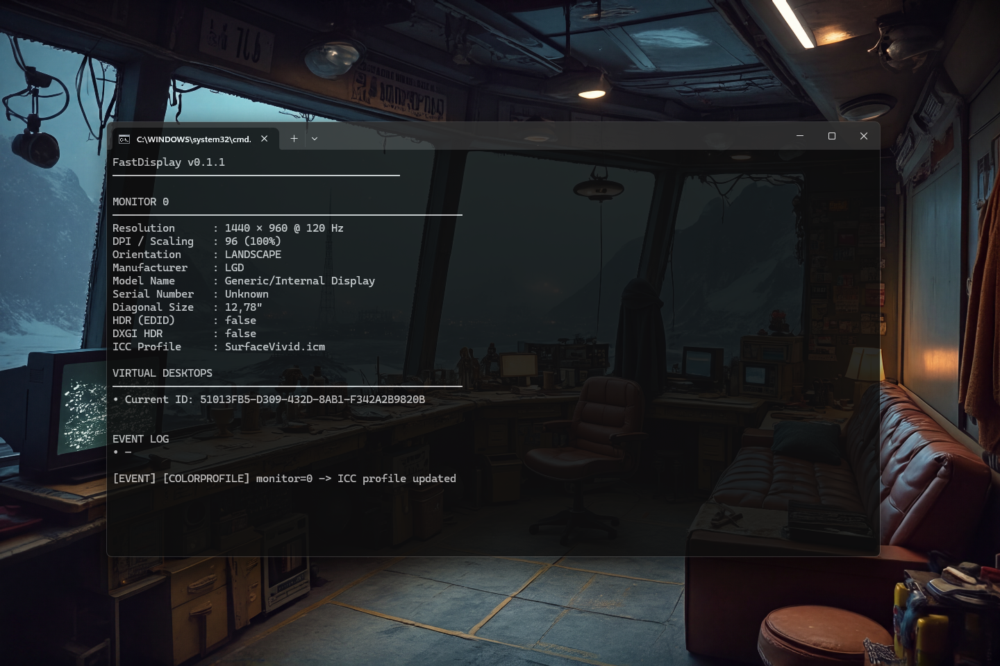

# FastDisplay 0.2.0 [ALPHA-2026-05-17] — Native Display Monitoring & DPI API for Java

[](https://github.com/andrestubbe/FastDisplay/releases/tag/v0.2.0)
[](https://opensource.org/licenses/MIT)
[](https://www.java.com)
[]()
[](https://jitpack.io/#andrestubbe/FastDisplay)

**🖥️ High-performance display telemetry for the FastJava ecosystem. Monitor resolution, DPI scaling, refresh rates, and orientation changes with zero latency.**

**FastDisplay** is the dedicated display monitoring module of the FastJava ecosystem. It provides real-time events for
display changes, allowing your Java application to respond instantly to resolution shifts or DPI scaling updates.

[](https://www.youtube.com/watch?v=BZsqQl7WqWk)

---

## Quick Start

```bash
# Clone the repository
git clone https://github.com/andrestubbe/FastDisplay.git

# Build the native bridge
cd FastDisplay
.\compile.bat

# Launch the DisplayDemo
.\run-demo.bat
```
---

---

## Table of Contents

- [Features](#features)
- [Quick Start](#quick-start)
- [Installation](#installation)
- [Build from Source](#build-from-source)
- [License](#license)

## Features

- **📊 Real-Time Telemetry**: Monitor Resolution, DPI, and Refresh Rate.
- **🔔 Event Driven**: Native callbacks for `WM_DISPLAYCHANGE` and `WM_DPICHANGED`.
- **🖥️ Multi-Monitor Support**: Detect and track attributes across multiple displays.
- **🌈 EDID & HDR Capabilities (v0.2.0)**: Hardware-level parsing of EDID, DXGI HDR detection, and ICC color profile extraction via `FastDisplayUtils`.
- **🪟 Virtual Desktops (v0.2.0)**: Integration with Windows Task View / Virtual Desktops through the `FastDesktop` sister module.
- **⏱️ Zero Overhead**: Lightweight JNI layer with no polling required.


## Installation

### Option 1: Maven (Recommended)

Add the JitPack repository and the dependencies to your `pom.xml`:

```xml
<repositories>
    <repository>
        <id>jitpack.io</id>
        <url>https://jitpack.io</url>
    </repository>
</repositories>
<dependencies>
   <dependency>
       <groupId>com.github.andrestubbe</groupId>
       <artifactId>fastdisplay</artifactId>
       <version>v0.2.0</version>
   </dependency>
   <dependency>
       <groupId>com.github.andrestubbe</groupId>
       <artifactId>fastcore</artifactId>
       <version>v0.2.0</version>
   </dependency>
</dependencies>
```

### Option 2: Gradle (via JitPack)

```groovy
repositories {
    maven { url 'https://jitpack.io' }
}
dependencies {
    implementation 'com.github.andrestubbe:fastdisplay:v0.2.0'
    implementation 'com.github.andrestubbe:fastcore:v0.2.0'
}
```

### Option 3: Direct Download (No Build Tool)

Download the latest JARs directly to add them to your classpath:

1. 📦 **[fastdisplay-v0.2.0.jar](https://github.com/andrestubbe/FastDisplay/releases/download/v0.2.0/fastdisplay-v0.2.0.jar)** (The Core Library)
2. ⚙️ **[fastcore-v0.2.0.jar](https://github.com/andrestubbe/FastCore/releases/download/v0.2.0/fastcore-v0.2.0.jar)** (The Mandatory Native Loader)

---

## Documentation

* **[COMPILE.md](docs/COMPILE.md)**: Full compilation guide (MSVC C++17 build chain + JNI Setup).
* **[REFERENCE.md](docs/REFERENCE.md)**: Full API descriptions, border configurations, and codepoint index.
* **[PHILOSOPHY.md](docs/PHILOSOPHY.md)**: The engineering rationale for zero-allocation performance.
* **[ROADMAP.md](docs/ROADMAP.md)**: Future milestones and planned features.

---

## Platform Support

| Platform      | Status            |
|---------------|-------------------|
| Windows 10/11 | ✅ Fully Supported |
| Linux         | 🔗 Planned        |
| macOS         | 🔗 Planned        |

---

## License

MIT License  See [LICENSE](LICENSE) file for details.

---

## Related Projects

- [FastCore](https://github.com/andrestubbe/FastCore) - Unified JNI loader and platform abstraction
- [FastANSI](https://github.com/andrestubbe/FastANSI) - Binary file indexing with mmap support
- [FastDWM](https://github.com/andrestubbe/FastDWM) - Prefix Trie, N-Gram index, and Ranking engine

---

**Part of the FastJava Ecosystem** — *Making the JVM faster. Small package. Maximum speed. Zero bloat. 🚀📋*


